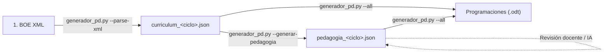
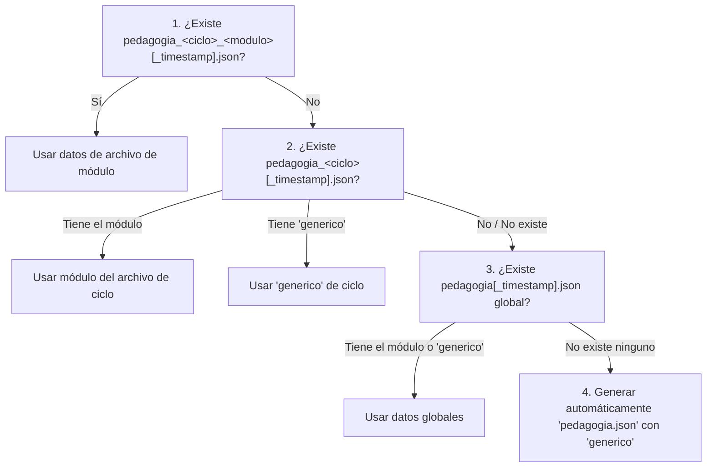

# 📘 Generador Sistemático de Programaciones Didácticas FP

Sistema integral de generación sistemática y automatizada de **Programaciones Didácticas oficiales de Formación Profesional** en formato nativo OpenDocument (`.odt`), editable directamente con LibreOffice Writer y conforme a la **Ley Orgánica 3/2022** y el **Real Decreto 659/2023**.

El sistema está completamente integrado en un único script ejecutable, **`generador_pd.py`**, que reúne y permite ejecutar de forma individual sus **tres funciones principales**:
1. **Parseo y extracción de currículos** (`--parse-xml`): Extrae decretos oficiales en XML del BOE, extrae competencias y módulos, y genera el archivo `curriculum_<ciclo>.json`.
2. **Generador del andamiaje pedagógico oficial** (`--generar-pedagogia`): Produce el archivo pedagógico específico por ciclo (`pedagogia_<ciclo>.json`) con unidades didácticas y ponderaciones proporcionales por RA, diseñado como plantilla base para modelos de IA o profesorado.
3. **Generador de Programaciones Didácticas** (`--all`, `--ciclo`, `--modulo`): Motor de maquetación ODF que une currículo, pedagogía y plantilla visual para generar los documentos `.odt` editables.

> **Comprobación y Subsanación Automática de Datos**:
> No es necesario validar manualmente los archivos JSON. Cada vez que el programa se ejecuta, analiza automáticamente la integridad de los currículos y de la pedagogía. Si detecta datos ausentes o incompletos (como siglas, horas, RAs, ponderaciones o recursos), **emite un aviso explícito al usuario (`[AVISO]`) y crea automáticamente datos genéricos coherentes**, permitiendo que la generación continúe sin interrupciones.

> **Política de Respaldo y Nuevas Versiones**:
> Ningún archivo JSON existente es jamás borrado ni sobrescrito. Si el archivo base ya existe, **la nueva versión generada se guarda con una marca de tiempo** (`_YYYYMMDD_HHMMSS.json`), manteniendo intacto el archivo previo.

---

## 🚀 1. Flujo de Trabajo en Tres Pasos (con `generador_pd.py`)



### Paso 1: Parsear el XML del BOE y Generar el Currículo
Descarga el XML oficial del decreto del BOE y procésalo directamente:
```bash
# Parsear XML oficial y generar curriculum_<ciclo>.json:
python generador_pd.py --parse-xml curriculums_originals/ASIR.xml --ciclo ASIR
```

### Paso 2: Generar el Andamiaje Pedagógico del Ciclo
Genera el archivo `pedagogia_<ciclo>.json` con ponderaciones proporcionales (suman 100%), 1 UP y 2 instrumentos genéricos por cada RA, y recursos estándar:
```bash
# Generar pedagogía para un ciclo específico:
python generador_pd.py --generar-pedagogia --ciclo DAM

# Generar pedagogía para todos los ciclos disponibles:
python generador_pd.py --generar-pedagogia --all
```
*(Este archivo JSON resultante sirve como andamiaje o plantilla para que un modelo de inteligencia artificial o el docente personalice la metodología y recursos).*

### Paso 3: Generar las Programaciones Didácticas ODT
Genera los documentos `.odt` oficiales listos para inspección o uso docente:
```bash
# Generar todas las programaciones de todos los ciclos:
python generador_pd.py --all

# Generar solo las de un ciclo:
python generador_pd.py --ciclo DAM

# Generar un único módulo:
python generador_pd.py --modulo 0489
```

---

## 🛠️ 2. Opciones y Parámetros del Comando (`generador_pd.py`)

| Función / Parámetro | Argumento | Descripción |
| :--- | :--- | :--- |
| **[Función 1: Currículo]** | | |
| `--parse-xml` | `ARCHIVO.xml` | Parsea un archivo oficial XML del BOE y genera `curriculum_<ciclo>.json` |
| **[Función 2: Pedagogía]** | | |
| `--generar-pedagogia` | Ninguno | Genera el andamiaje pedagógico JSON para el ciclo (`--ciclo`) o todos (`--all`) |
| `--extraer-pedagogia` | `[CARPETA]` | Extrae datos pedagógicos reales desde los documentos del centro (DOCX/PDF) en `CURS 26_27` |
| **[Función 3: Generación ODT]** | | |
| `--all` | Ninguno | Aplica la acción a todos los ciclos disponibles (generar ODTs o pedagogía) |
| `--ciclo` | `CODIGO` | Filtra por ciclo formativo (ej. `DAM`, `DAW`, `SMX`, `IA`, `ASIR`) |
| `--modulo` | `CODIGO` | Genera solo el módulo indicado (por código o nombre) |
| `--curso-escolar` | `"AÑO / AÑO"` | Curso escolar reflejado en portadas y encabezados (por defecto: `"2026 / 2027"`) |
| `--plantilla` | `RUTA.fodt` | Ruta a una plantilla ODF base alternativa (por defecto: `plantilla.fodt`) |
| `--output-dir` | `CARPETA` | Carpeta raíz de salida de los documentos (por defecto: `programaciones`) |
| `--output` / `-o` | `ARCHIVO` | Nombre de archivo de salida personalizado (.odt o .json) |

---

## 🧩 3. Procedimiento para Añadir Nuevos Ciclos Formativos

El sistema está diseñado para incorporar nuevos títulos de Formación Profesional de manera modular:

### Opción A (Recomendada): Parseo de XML Oficial del BOE
1. Descarga el XML oficial del decreto del BOE y guárdalo en `curriculums_originals/<CICLO>.xml`.
2. Ejecuta:
   ```bash
   python generador_pd.py --parse-xml curriculums_originals/ASIR.xml --ciclo ASIR
   python generador_pd.py --generar-pedagogia --ciclo ASIR
   python generador_pd.py --ciclo ASIR
   ```

### Opción B: Creación Directa de un archivo JSON (`curriculum_<ciclo>.json`)

Si no se dispone del XML del BOE, puede crearse un archivo `curriculum_<codigo_ciclo>.json` en la raíz del proyecto (ej. `curriculum_asir.json`):

```json
{
  "ciclo": "ASIR",
  "codigo_ciclo": "IFCS02",
  "titulo": "Ciclo Formativo de Grado Superior en Administración de Sistemas Informáticos en Red",
  "familia_profesional": "Informática y Comunicaciones",
  "nivel": "Grado Superior",
  "normativa_referencia": "Real Decreto 1629/2009, de 30 de octubre",
  "competencias_profesionales_personales_sociales": {
    "a": "Administrar sistemas operativos de servidor...",
    "b": "Configurar y administrar redes locales...",
    "c": "Implantar y gestionar bases de datos..."
  },
  "cualificaciones_profesionales": [
    {
      "codigo": "IFC365_3",
      "denominacion": "Administración de sistemas informáticos",
      "unidades_competencia": ["UC0490_3", "UC0491_3"]
    }
  ],
  "unidades_competencia": {
    "UC0490_3": "Gestionar servicios en el sistema informático",
    "UC0491_3": "Administrar sistemas operativos de servidor"
  },
  "modulos": [
    {
      "codigo": "0369",
      "nombre": "Implantación de sistemas operativos",
      "curso_orientativo": "1º",
      "horas": 160,
      "creditos_ects": 8,
      "unidades_competencia": ["UC0491_3"],
      "competencias_titulo": ["a", "b", "c"],
      "orientaciones_pedagogicas": "La formación del módulo contribuye a alcanzar las competencias...",
      "resultados_aprendizaje": [
        {
          "numero": 1,
          "descripcion": "Instala sistemas operativos planificando el proceso...",
          "criterios_evaluacion": [
            {"letra": "a", "descripcion": "Se han identificado los elementos del hardware..."},
            {"letra": "b", "descripcion": "Se ha seleccionado el sistema operativo..."}
          ]
        }
      ]
    }
  ]
}
```

---

## 📖 3. Procedimiento para Añadir o Personalizar Módulos Profesionales

## 📖 4. Resolución Pedagógica en Cascada

Para determinar la metodología, unidades didácticas, ponderaciones de RAs, instrumentos y recursos de un módulo, el sistema busca los datos siguiendo una **estricta resolución en cascada de 4 niveles**:



1. **Nivel 1 (Máxima prioridad)**: Archivo específico de ciclo y módulo `pedagogia_<ciclo>_<modulo>[_timestamp].json` (ej. `pedagogia_dam_0489.json` o `pedagogia_dam_0489_20260905_120000.json`). Si existen múltiples versiones con timestamp, se selecciona la más reciente.
2. **Nivel 2**: Archivo específico de ciclo `pedagogia_<ciclo>[_timestamp].json` (ej. `pedagogia_dam.json`):
   - Si contiene la clave del módulo (`"0489"`), se usa esa.
   - Si no, pero contiene una clave `"generico"`, se usan los datos genéricos definidos para ese ciclo.
3. **Nivel 3**: Archivo global de pedagogía `pedagogia[_timestamp].json` (ej. `pedagogia.json`):
   - Si contiene el módulo o una entrada `"generico"`, se usa esa.
4. **Nivel 4 (Creación automática si no hay ninguno)**:
   - Si al ejecutarse el programa para generar programaciones no se encuentra **ningún** archivo de pedagogía en el sistema, **se genera automáticamente `pedagogia.json` con un módulo genérico**, informando al usuario de dicha creación.

> **Adaptación automática**: Siempre que se utiliza un módulo genérico (clave `"generico"` o generado), el sistema adapta dinámicamente las unidades didácticas y ponderaciones equitativas (suman 100%) al número real de Resultados de Aprendizaje (RAs) y horas del módulo a maquetar.

---

### Personalización de un Módulo Profesional

Para personalizar la pedagogía de un módulo, basta con crear su archivo específico (Nivel 1, ej. `pedagogia_dam_0489.json`) o añadirlo en el archivo de su ciclo (Nivel 2, `pedagogia_dam.json`):

```json
{
  "unidades": [
    {
      "codigo": "UD 1",
      "nombre": "Arquitectura y Desarrollo Móvil",
      "ras": [1],
      "horas": 30,
      "trimestre": "1er Trimestre",
      "inicio": "Septiembre",
      "fin": "Octubre"
    },
    {
      "codigo": "UD 2",
      "nombre": "Interfaces Gráficas y Layouts",
      "ras": [2],
      "horas": 35,
      "trimestre": "1er Trimestre",
      "inicio": "Octubre",
      "fin": "Noviembre"
    }
  ],
  "ra_ponderaciones": {
    "1": 40.0,
    "2": 60.0
  },
  "formula_evaluacion": "Módulo = 0.40 · RA_1 + 0.60 · RA_2",
  "instrumentos": {
    "1": [
      {"nombre": "Proyecto práctico de entorno Android", "peso_ra": 60.0},
      {"nombre": "Cuestionario técnico conceptual", "peso_ra": 40.0}
    ],
    "2": [
      {"nombre": "Desarrollo de aplicación responsive", "peso_ra": 70.0},
      {"nombre": "Revisión de diseño de interfaces", "peso_ra": 30.0}
    ]
  },
  "metodologia": "Metodología activa basada en retos semanales...",
  "recursos_software": [
    "Android Studio / Kotlin",
    "Emulador Android y dispositivos físicos"
  ],
  "recursos_hardware": [
    "Equipos con soporte de virtualización VT-x / AMD-V",
    "Dispositivos móviles Android para pruebas"
  ],
  "espacios": "Laboratorio de informática y desarrollo de aplicaciones."
}
```

---

### Paso 2: Indicar las Siglas del Módulo en el Currículo JSON

Las siglas oficiales del módulo para la nomenclatura de archivos se declaran directamente en el archivo `curriculum_<ciclo>.json`, dentro de la definición del módulo (campo `"siglas"`):

```json
{
  "codigo": "0369",
  "nombre": "Implantación de sistemas operativos",
  "siglas": "ISO",
  "curso_orientativo": "1º",
  "horas": 160
}
```

> **Nota**: Si se omite el campo `"siglas"`, el generador no fallará: calculará automáticamente unas siglas consistentes a partir de las iniciales de su denominación oficial.

---

### Paso 3: Centralización de Valores por Defecto (`DEFAULT_CONFIG`)

Todos los valores por defecto del sistema (centro educativo, departamento docente, curso escolar, textos de respaldo sin acreditación directa, recursos e instrumentos estándar) están reunidos en la estructura `DEFAULT_CONFIG` al inicio de `generador_pd.py`:

```python
DEFAULT_CONFIG = {
    "metadata": {
        "centro": "IES Benigasló",
        "profesor": "Profesorado del Departamento de Informática",
        "curso_academico": "2026 / 2027",
        "familia_profesional": "Informática y Comunicaciones",
        "nivel": "Grado Superior",
        "output_dir": "programaciones",
        "template_path": "plantilla.fodt"
    },
    "acreditacion": { ... },
    "pedagogia": { ... }
}
```
Cualquier ajuste institucional general puede realizarse modificando directamente este diccionario de configuración.

---

## 🎨 4. Personalización de la Plantilla Maestra (`plantilla.fodt`)

La plantilla base está en formato **Flat XML ODF** (`plantilla.fodt`). Puede abrirse y modificarse directamente con **LibreOffice Writer**:

1. **Editar diseño con LibreOffice**:
   - Abre `plantilla.fodt` con LibreOffice Writer.
   - Modifica tipografías, colores corporativos, logotipos, márgenes de página o estilos de celda.
   - Guarda el documento directamente en LibreOffice (*Guardar* o `Ctrl+S`).
2. **Requisitos de tablas para el generador**:
   El motor de clonación ODF identifica las tablas por su nombre (`table:name`). Para asegurar la compatibilidad, **no cambies el nombre de las siguientes tablas**:
   - `CoverMeta`: Ficha técnica de la portada (8 filas predefinidas).
   - `Table_36848684`: Tabla de Unidades de Competencia (2 columnas: UC y Cualificación).
   - `Table_49111049`: Tabla de RAs y Competencias del Título vinculadas.
   - `Tabla1`: Secuenciación temporal de Unidades Didácticas (6 columnas: UP, RAs, Duración, Trimestre, Inicio, Fin).
   - `Tabla_Evaluacion_RA`: Ponderación de los RAs sobre la nota del módulo.
   - `Tabla_Evaluacion_Instrumentos`: Instrumentos de evaluación por cada RA y porcentaje final.
3. **Placeholders admitidos**:
   Puedes insertar libremente placeholders en el texto o celdas de la plantilla:
   - `{{modulo}}`: Denominación oficial completa (código y nombre, ej. `0489 - Programación multimedia...`).
   - `{{nombre_modulo}}` (o `{{modulo_nombre}}`): Denominación del módulo **únicamente** (sin el código numérico, ej. `Programación multimedia y dispositivos móviles`).
   - `{{codigo_modulo}}` (o `{{modulo_codigo}}`): Código oficial de 4 dígitos (ej. `0489`).
   - `{{siglas}}` (o `{{modulo_siglas}}`): Siglas oficiales del módulo (ej. `PMYDM`).
   - `{{ciclo}}`: Título completo del ciclo y siglas.
   - `{{familia}}`: Familia profesional.
   - `{{curso}}`: Curso (1º o 2º).
   - `{{horas}}`: Horas lectivas totales.
   - `{{ects}}`: Créditos ECTS.
   - `{{normativa_referencia}}`: Real Decreto del título.
   - `{{profesor}}`: Profesorado responsable del departamento.
   - `{{centro}}`: Nombre del centro educativo.
   - `{{curso_academico}}`: Curso escolar (ej. 2026 / 2027).
   - `{{contextualizacion_modulo}}`: Expansión automática por párrafos y viñetas del BOE.
   - `{{metodologia_especifica}}`, `{{recursos_especificos}}`, `{{espacios_especificos}}`, `{{formula_evaluacion}}`.

---

## 📁 5. Estructura del Proyecto

```text
programacions_didactiques/
├── generador_pd.py             # Script único: Parseo XML, Generación pedagógica y Maquetación ODT
├── plantilla.fodt              # Plantilla maestra editable en LibreOffice Writer
├── README.md                   # Esta documentación técnica de referencia
├── curriculum_dam.json         # Currículo oficial de DAM (BOE)
├── curriculum_daw.json         # Currículo oficial de DAW (BOE)
├── curriculum_smx.json         # Currículo oficial de SMX (BOE)
├── pedagogia_dam.json          # Andamiaje pedagógico de DAM
├── pedagogia_daw.json          # Andamiaje pedagógico de DAW
├── pedagogia_smx.json          # Andamiaje pedagógico de SMX
├── curriculums_originals/      # Depósito de archivos XML oficiales descargados del BOE
│   ├── DAM_DAW.xml
│   ├── SMX.xml
│   └── (futuros ciclos: ASIR.xml, etc.)
└── programaciones/             # Directorio de salida de los documentos generados
    ├── DAM/                    # Archivos PD_26-27_DAM*.odt
    ├── DAW/                    # Archivos PD_26-27_DAW*.odt
    └── SMX/                    # Archivos PD_26-27_SMX*.odt
```

